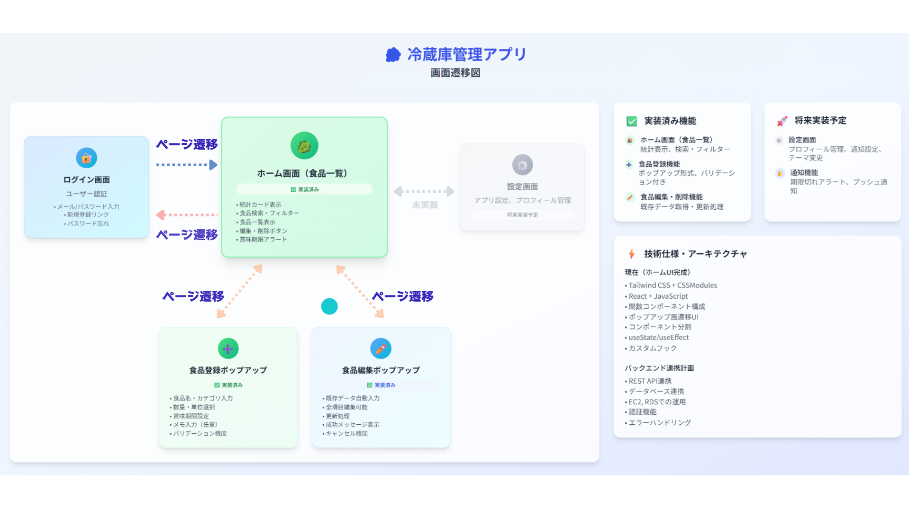

# 冷蔵庫管理アプリ - フロントエンド仕様書

## 1. 概要

このアプリケーションは、家庭の冷蔵庫内の食品を効率的に管理することを目的としたWebアプリケーションのフロントエンド部分です。
ユーザー認証機能を備え、ログインしたユーザーごとに食品の登録、一覧表示、編集、削除（CRUD）が可能です。

## 2. 主な機能

- **ユーザー認証**
  - 新規アカウント作成機能
  - ログイン・ログアウト機能
  - パスワードリセット機能（UIのみ）
- **食品管理 (CRUD)**
  - 食品の登録（品名、カテゴリ、数量、賞味期限など）
  - 登録済み食品の一覧表示
  - 食品情報の編集
  - 食品の削除（確認ダイアログ付き）
- **検索・フィルタリング**
  - 食品名によるリアルタイム検索
  - カテゴリによる絞り込み
- **統計表示**
  - 総食品数
  - 賞味期限が近い食品数
  - 期限切れの食品数

## 3. 技術スタック

- **フレームワーク**: React 19
- **ビルドツール**: Vite
- **スタイリング**: Tailwind CSS, CSS Modules
- **ルーティング**: React Router
- **言語**: JavaScript (JSX)

## 4. セットアップと実行方法

1. **依存関係のインストール:**
   ```bash
   yarn install
   ```

2. **開発サーバーの起動:**
   ```bash
   yarn dev
   ```
   サーバーが起動し、 `http://localhost:5173` などでアプリケーションにアクセスできます。

   ◆ スクリーンショット                                                                  

### ログイン画面                                                                                                                      
                                                                                   

                                                               
### ホーム画面                                                                                                                      
                                                                                            
                                                                                                                                    
### 画面遷移図                                                                                                                      
  

## 5. ディレクトリ構造

```
RefrigeratorManagement.front/
│  index.html         # SPAのエントリポイント
│  vite.config.js     # Vite設定ファイル
│  tailwind.config.js # Tailwind CSS設定ファイル
│  postcss.config.js  # PostCSS設定ファイル
│  package.json       # プロジェクト定義と依存関係
│
├─public/            # 静的ファイル
│
└─src/               # ソースコード
    │  App.jsx          # アプリケーションのメインコンポーネント、ルーティング管理
    │  main.jsx         # Reactアプリケーションのエントリポイント
    │  const.js         # 定数（ルーティングパス、カテゴリ情報など）
    │  index.css        # グローバルなスタイルシート
    │
    ├─api/             # API連携関連（現在は未使用）
    │
    ├─component/       # 再利用可能なUIコンポーネント
    │  │  Header.jsx
    │  │  FoodList.jsx
    │  │  InputField.jsx
    │  │  (他多数...)
    │  └─styles/        # コンポーネント固有のCSSモジュール
    │
    ├─data/            # モックデータ
    │      MockFoodData.js
    │      MockUserData.jsx
    │
    └─pages/           # 各ページに対応するコンポーネント
        │  Home.jsx
        │  Login.jsx
        │  Register.jsx
        │  FoodAdd.jsx
        │  FoodEdit.jsx
        └─styles/        # ページ固有のCSSモジュール
```

## 6. コンポーネントの役割

### `pages` （ページ単位コンポーネント）

- **`App.jsx`**: アプリケーション全体の司令塔。状態管理（食品データ、ユーザー情報）、ルーティングの定義、データ操作関数（追加、編集、削除）を一元管理します。
- **`Home.jsx`**: ログイン後のメイン画面。ヘッダー、統計カード、検索エリア、食品リストなど、各UIセクションを統合して表示します。
- **`Login.jsx`**: ログインページ。ユーザー認証を行い、成功時にはHOME画面に遷移します。パスワードリセット機能も提供します。
- **`Register.jsx`**: 新規アカウント作成ページ。ユーザー名、メールアドレス、パスワードを登録します。
- **`FoodAdd.jsx`**: 食品追加モーダル。スライドイン形式で表示され、新しい食品を登録するためのフォームを提供します。
- **`FoodEdit.jsx`**: 食品編集モーダル。既存の食品情報を編集するためのフォームを提供します。

### `component` （UI部品コンポーネント）

- **`Header.jsx`**: `Home.jsx`の上部に表示されるヘッダー。ログイン中のユーザー名、アイコン、ログアウトボタンを表示します。
- **`LoginHeader.jsx` / `LoginFooter.jsx`**: ログイン・新規登録ページで共通して使用されるヘッダーとフッターです。
- **`FoodList.jsx` / `FoodListItem.jsx`**: 食品一覧およびその各項目を表示します。賞味期限に応じて背景色が変化します。
- **`SearchBarContainer.jsx`**: 検索バー、カテゴリフィルター、追加ボタンをまとめるコンテナです。
- **`InputField.jsx`**: アイコン付きのテキスト入力フィールドです。ログイン・登録・食品編集フォームなどで広く使用されます。
- **`FunctionButton.jsx`**: アプリ内で共通して使われる汎用的なボタンスタイルです。
- **`MessageField.jsx`**: ログイン処理中やエラー時などに、状態をユーザーに伝えるためのメッセージボックスです。
- **`ToggleButton.jsx`**: パスワードの表示・非表示を切り替えるボタンです。
- **`DemoInfo.jsx`**: 開発用に、デモユーザーのログイン情報を表示するコンポーネントです。

## 7. データ構造

アプリケーションは現在モックデータを使用しています。

### ユーザーデータ (`MockUserData.jsx`)

```javascript
{
  userId: 1,
  userName: "田中太郎",
  gender: "male",
  email: "demo1@example.com",
  password: "password123",
  icon: <svg>...</svg> // JSX要素としてのアイコン
}
```

### 食品データ (`MockFoodData.js`)

```javascript
{
  id: 1,
  name: 'にんじん',
  category: '野菜',
  quantity: 3,
  unit: '本',
  expiryDate: '2025-09-20',
  memo: 'カレーに使う',
  icon: '🥕'
}
```

## 8. 今後の拡張予定

- バックエンドAPIとの連携によるデータ永続化
- ユーザーごとの食品データ管理
- より詳細な統計・分析機能の追加
